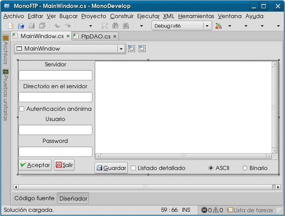
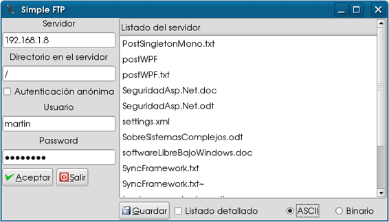
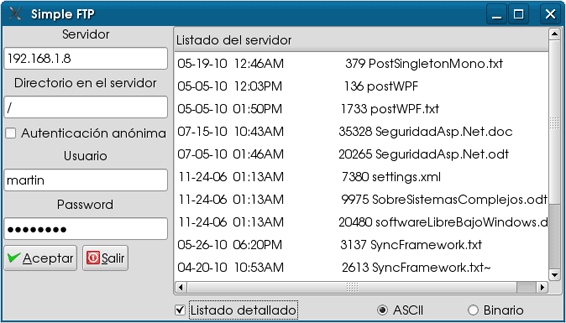
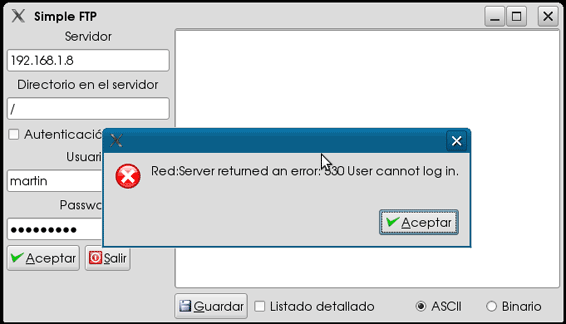
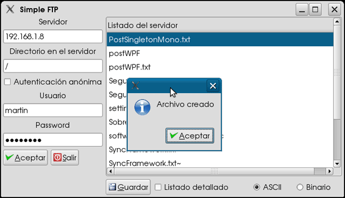
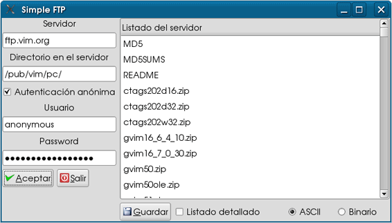

# Utilizando la clase FtpWebRequest para un cliente básico FTP con MonoDevelop

Una de las tareas más habituales que existen en el tema de interacción entre sistemas es la copia de archivos de una máquina a otra, existen distintos mecanismos según el tipo de sistema operativo que se disponga entre la máquina destino y la máquina fuente, por ejemplo si se trata de sistemas UNIX/Gnu/Linux podemos utilizar el comando rcp o scp si se trata del servicio SSH.

Para el caso de copiar archivos entre sistemas operativos distintos la opción más común es utilizar el protocolo FTP (File Transfer Protocol) que es un protocolo orientado al usuario que hace uso de comandos para realizar operaciones con archivos en el servidor donde se establece la comunicación y para el cual .NET nos ofrece la clase FtpWebRequest que encapsula toda la funcionalidad de un cliente FTP y de los comandos propios del protocolo mediante los campos de la clase WebRequestMethods.Ftp.

<pre>

+====================+========+==========================================+
| OPERACIÓN          |COMANDO | DESCRIPCIÓN                              |
+====================+========+==========================================+
|AppendFile          |APPE    | Anexa un archivo a un archivo existente. |
+--------------------+--------+------------------------------------------+
|DeleteFile          | DELE   | Elimina un archivo existente.            |
+--------------------+--------+------------------------------------------+
|DownloadFile        | RETR   | Descarga un archivo existente.           |
+--------------------+--------+------------------------------------------+
|GetDateTimestamp    | MDTM   | Obtiene el date-time stamp de un archivo.|
+--------------------+--------+------------------------------------------+
|GetFileSize         | SIZE   | Obtiene el tamaño de un archivo.         |
+--------------------+--------+------------------------------------------+
|ListDirectory       | NLIST  | obtiene un listado corto de los archivos |
|                               de un directorio en el servidor.         |
+--------------------+---------------------------------------------------+
|ListDirectoryDetails| LIST   | Obtiene un listado detallado de los      |
                                archivos de un directorio en el servidor.|  
+--------------------+--------+------------------------------------------+
|MakeDirectory       | MKD    | Crea un directorio en el servidor.      |    
+----------------------+------+-----------------------------------------+
|PrintWorkingDirectory | PWD  | Imprime el nombre del directorio        |
                                 de trabajo.                            |
+----------------------+------+-----------------------------------------+
|RemoveDirectory       | RMD  | Elimina un directorio.                  |
+----------------------+------+-----------------------------------------+
|Rename                | RENAME| Renombra un directorio.                |
+----------------------+-------+----------------------------------------+
|UploadFile            | STOR  | Envia un archivo al servidor.          |
+------------------------+-----+----------------------------------------+
|UploadFileWithUniqueName|STOU |Envia un archivo con                    |
                                un nombre unico al servidor.            |
+------------------------+-----+----------------------------------------+
</pre>

Y que ejemplificaremos a continuación programando un cliente FTP básico con MonoDevelop.
Ejecutamos MonoDevelop y diseñamos un formulario GTK# como se muestra en la siguiente imagen:

Agregamos una nueva clase a nuestro proyecto con el nombre de FtpDAO, que es donde se encontrarán los métodos que darán la funcionalidad a nuestro formulario.
En esta clase hacemos referencia a los siguientes ensamblados:

<pre>
using System.IO;
using System.Net;
</pre>

Y completamos la funcionalidad de la clase con los siguientes métodos.
Para listar los archivos del directorio en el servidor, escribimos el siguiente método:

<pre>
	_ftprequest = (FtpWebRequest)WebRequest.Create(serverUri);
        _ftprequest.Credentials = creden;
        _ftprequest.KeepAlive = true;
        ListStore ls_l = new ListStore(typeof(string));
        if(lsl)
        _ftprequest.Method = WebRequestMethods.Ftp.ListDirectoryDetails;
        else
        _ftprequest.Method = WebRequestMethods.Ftp.ListDirectory;
        _ftprequest.UseBinary = true;
        _ftprequest.UsePassive = true;
        _ftprequest.Timeout = 20000;
</pre>

Que nos regresa la lista de los archivos en un objeto ListStore que servirá de modelo para nuestra interfaz gráfica.
Con el siguiente código establecemos un Uri con la dirección IP o Host y con el directorio al cuál accedemos.

<pre>
string.Format("ftp://{0}/{1}/",txtServer.Text,txtDir.Text);
</pre>

La clase Uri sirve para encapsular un URI (Uniform Resource Identifier) que es una manera de identificar
Sin ambigüedades un recurso en Internet, puede ser un archivo, una dirección email o una dirección IP con su protocolo. Hay dos tipos de URIs: URL (Universal Resource Location) o URN (Universal Resource Names), en C# la clase Uri nos brinda todos los métodos y propiedades para el manejo de URI's.
En nuestro ejemplo será la URL del servidor de FTP, como se utiliza con la línea.

<pre>
Uri serverUri = new Uri(string.Format("ftp://{0}/{1}/",txtServer.Text,txtDir.Text));
</pre>

Donde concatenamos el protocolo con la IP o nombre del servidor y el directorio donde mostramos el listado, para después seleccionar el archivo a descargar.

<h3>C# WebRequest y WebResponse</h3>

La clase System.Net.WebRequest representa una petición al servidor y la clase System.Net.WebResponse representa la respuesta del servidor como un flujo de datos o StreamReader.
Usamos el método estático Create de WebRequest para solicitar el recurso del servidor dependiendo del URI que le pasemos como parámetro.

<pre>
_ftprequest = (FtpWebRequest)WebRequest.Create(serverUri);
</pre>

Usamos el método GetResponse para obtener la respuesta como un flujo de datos y asociándola a un objeto StreamReader.

<pre>
using(FtpWebResponse listResponse = (FtpWebResponse)_ftprequest.GetResponse()){
using(StreamReader reader = new StreamReader(listResponse.GetResponseStream())){
</pre>
Podemos establecer el timeout de la respuesta en milisegundos con la propiedad timeout que tiene un valor predeterminado de 10000.

Al construir y ejecutar la aplicación veremos los resultados como en las siguientes imágenes.

Al oprimir el botón Aceptar después de teclear la IP, el directorio, el usuario y el password, si son válidos para el servidor se muestra el listado de los archivos.

Si activamos la casilla de Listado detallado mostrará el listado detallado de los archivos.

En caso de que ocurra un error en la conexión con el servidor, se mostrará un mensaje con la excepción correspondiente.

Si seleccionamos un archivo de la lista de archivos y pulsamos el botón guardar se solicitará el archivo del servidor y se guardará en el disco duro en el directorio donde se ejecute la aplicación.

En la siguiente imagen la aplicación se conecta a un sitio público habilitando la casilla de autenticación anónima.

